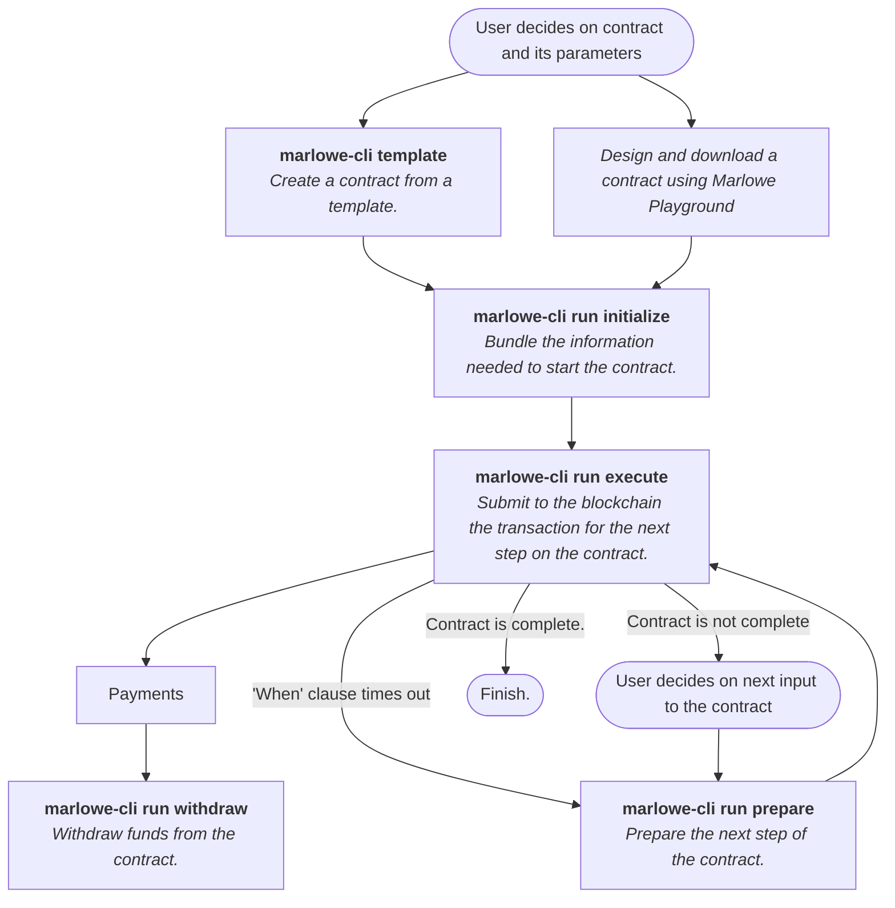

* Provides capabilities to work with Marlowe's Plutus validators and run Marlowe contracts manually. 
* Lightweight: no other tools or services needed.
* Executable program: `marlowe-cli`.

Marlowe CLI is a command-line tool that provides access to Marlowe capabilities on testnet and mainnet. It is specifically built for running Marlowe contracts directly without needing a web browser or mobile app. 

Just as the `cardano-cli` tool enables plain transactions, simple scripts, and Plutus scripts, the Marlowe CLI tool facilitates your ability to interact with and develop Marlowe contracts. You can measure transaction size, submit transactions, test your integration with wallets, and debug validators. The tool provides a very concrete representation of Marlowe contracts that is quite close to what is occurring on-chain. 

You can create your own workflow that operates Marlowe or your own toolset so you can wrap the Marlowe CLI tool in the way that developers have wrapped `cardano-cli` to create services such as libraries, faucets, and marketplaces. 

A high level overview of how `marlowe-cli` is used with a typical workflow is shown below:

See the **[ReadMe](https://github.com/input-output-hk/marlowe-cardano/blob/main/marlowe-cli/ReadMe.md)** for more complete details on the full set of commands and feature flags.
