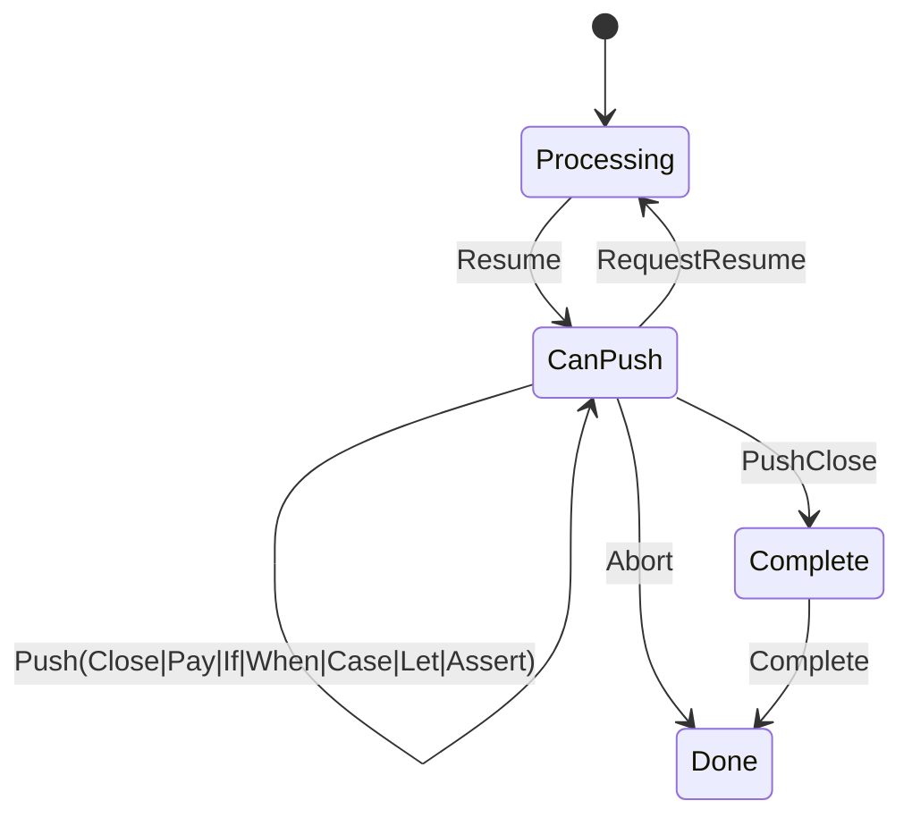

The MarloweLoad sub-protocol is defined here: 

- **[https://github.com/input-output-hk/marlowe-cardano/blob/main/marlowe-runtime/contract-api/Language/Marlowe/Protocol/Load/Types.hs](https://github.com/input-output-hk/marlowe-cardano/blob/main/marlowe-runtime/contract-api/Language/Marlowe/Protocol/Load/Types.hs)**

Below is a state diagram for the MarloweLoad sub-protocol: 

The MarloweLoad sub-protocol is used to incrementally push a contract into the contract store.
It uses a stack-based representation of contracts which allows them to be built one node at a time in a depth-first traversal.
The client is instructed to push N contract nodes by the server. The client
sends up to N `Push*` messages and either stops to request more pushes or
terminates when the contract is complete. Upon completion, the server sends the
hash of the deeply merkleized version of the contract which can be used to
lookup the contract in the store.

### Sub-protocol states

| Protocol state | Agency | Parameter | Description |
| --- | --- | --- | --- |
| 1. `Processing node` | `Server` | | The server is processing previous nodes from the client. |
| | | `node` | The stack of parent nodes that have been pushed. |
| 2. `CanPush n node` | `Client` | | The client is pushing nodes to the server. |
| | | `n` | The number of pushes the client can still perform before requesting more. |
| | | `node` | The stack of parent nodes that have been pushed. |
| 3. `Complete` | `Server` | | The client has finished pushing nodes. |
| 4. `Done` | `Nobody` | | The protocol session is done. |

### `node` types

A node is a location in a contract that requires sub-contracts to be pushed.
The following node types are defined:

| Name | Description |
| --- | --- |
| Root | The root node. Requires one contract to be pushed to it. |
| Pay parent | A pay node under some parent node. Requires one contract to be pushed to it. |
| IfL parent | An if node under some parent node focused on the left (then) clause. Requires two contracts to be pushed to it (then and else). |
| IfR parent | An if node under some parent node focused on the right (else) clause. Requires one contract to be pushed to it. |
| When parent | A when node under some parent node. Accepts zero or more case and then requires one contingency contract to be pushed to it. |
| Case parent | A case node under the parent node of its parent when node. Requires one contract to be pushed to it. |
| Let parent | A let node under some parent node. Requires one contract to be pushed to it. |
| Assert parent | An assert node under some parent node. Requires one contract to be pushed to it. |

### `Pop` pseudo-state

There is a pseudo-state called `Pop` which is actually a function that resolves
to one of the four states listed above depending on the current parent stack.
The rules for computing the state `Pop n node` are as follows:

| In case `node` is | Transition to | Because |
| --- | --- | --- |
| `Root` | `Complete` | There are no more empty locations in the contract to fill, so it is complete. |
| `Pay parent` | `Pop n parent` | The single continuation for the pay node has already been filled. |
| `IfL parent` | `CanPush n (IfR parent)` | Only the first sub-contract (then-clause) of the if node has been filled. |
| `IfR parent` | `Pop n parent` | Both sub-contracts of the if node have been filled. |
| `When parent` | `Pop n parent` | The contingency of the when node has been filled. |
| `Case parent` | `CanPush n (When parent)` | The parent of a `case` node is always a when, and it can receive more cases or a contingency clause. |
| `Let parent` | `Pop n parent` | The single continuation for the let node has already been filled. |
| `Assert parent` | `Pop n parent` |The single continuation for the assert node has already been filled. |

The `Pop` state is used to compute the target state of a `PushClose` message.

### Messages

| Message | Begin state | End state | Parameter | Description |
| --- | --- | --- | --- | --- |
| 1. `Resume n` | `Processing node` | `CanPush n node` |  | The server clears the client to push n more nodes. |
| | | | `n` | The number of nodes the client is allowed to push. |
| 2. `PushClose` | `CanPush (n + 1) node` | `Pop n node` |  | The client pushes a close node onto the stack, popping it to the next location that can receive more nodes. |
| 3. `PushPay account payee token value` | `CanPush (n + 1) node` | `CanPush n (Pay node)` |  | The client pushes a pay node onto the stack. |
| | | | `account` | The account that sends the funds. |
| | | | `payee` | The account or party that receives the funds. |
| | | | `token` | The currency and token name to send. |
| | | | `value` | The quantity to send expressed as a marlowe value expression. |
| 4. `PushIf cond` | `CanPush (n + 1) node` | `CanPush n (IfL node)` |  | The client pushes an if node onto the stack. |
| | | | `cond` | The condition that determines which branch of the contract will be in effect. |
| 5. `PushWhen timeout` | `CanPush (n + 1) node` | `CanPush n (When node)` |  | The client pushes a when node onto the stack. |
| | | | `timeout` | The time starting from which the contingency branch is in effect. |
| 6. `PushCase action` | `CanPush (n + 1) (When node)` | `CanPush n (Case node)` |  | The client pushes a case node onto a parent when node. |
| | | | `action` | The action that would cause this branch to come into effect if no prior branches match. |
| 7. `PushLet id value` | `CanPush (n + 1) node` | `CanPush n (Let node)` |  | The client pushes a let node onto the stack. |
| | | | `id` | The name to give to the value. |
| | | | `value` | The value to evaluate. |
| 8. `PushAssert obs` | `CanPush (n + 1) node` | `CanPush n (Assert node)` |  | The client pushes an assert node onto the stack. |
| | | | `obs` | The observation to evaluate. |
| 9. `RequestResume` | `CanPush 0 node` | `Processing node` |  | The client has no pushes left and is requesting more. |
| 10. `Abort` | `CanPush n node` | `Done` |  | The client is prematurely ending the session. |
| 11. `Complete hash` | `Complete` | `Done` |  | The server sends the hash of the contract and closes the session. |
| | | | `hash` | The hash of the deeply-merkleized contract. |

