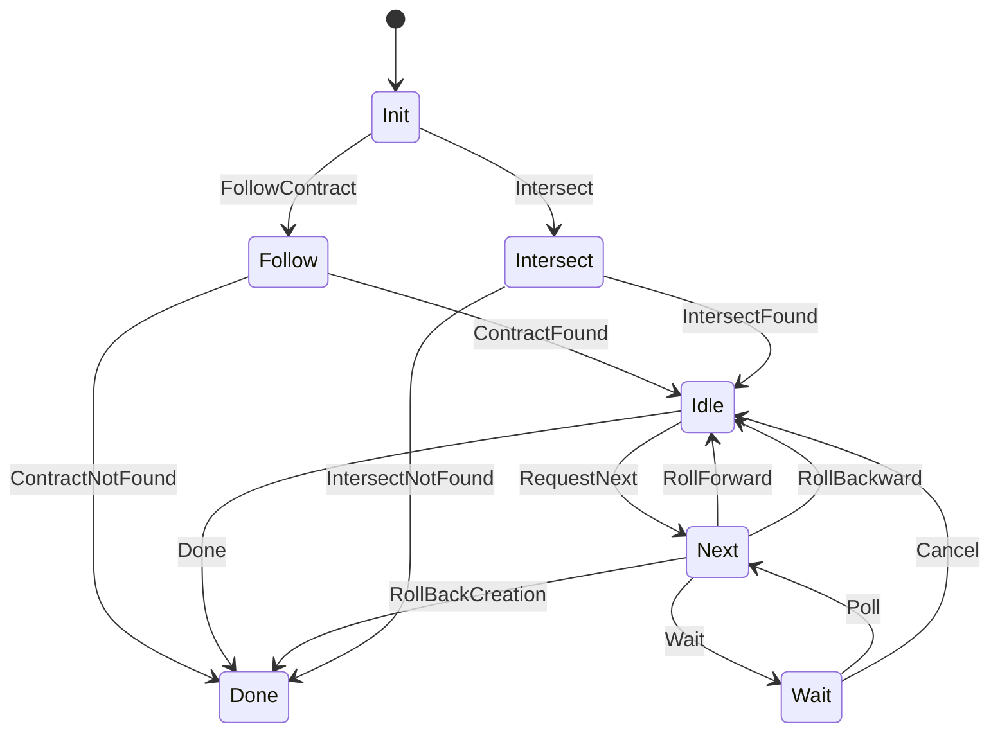

The MarloweSync sub-protocol is defined here: 

- **[https://github.com/input-output-hk/marlowe-cardano/blob/main/marlowe-runtime/history-api/Language/Marlowe/Protocol/Sync/Types.hs](https://github.com/input-output-hk/marlowe-cardano/blob/main/marlowe-runtime/history-api/Language/Marlowe/Protocol/Sync/Types.hs)**

Below is a state diagram for the MarloweSync sub-protocol: 

The MarloweSync sub-protocol is used to synchronize the history of a specific Marlowe contract.
The client receives a stream of blocks, the first of which contains a "create step", with subsequent blocks containing one or more "contract step(s)". 
A create step is information related to the contract creation transaction.
A contract step is either an "apply inputs" step with an apply inputs transaction that advances the contract, or a "withdraw" step where funds paid by the contract are withdrawn from the payout validator.

### Sub-protocol states

| Protocol state | Agency | Parameter | Description |
| --- | --- | --- | --- |
| 1. `Init` | `Client` | | The initial state. |
| 2. `Follow` | `Server` | | The server is processing a request to follow a contract. |
| 3. `Done` | `Nobody` | | The terminal state. |
| 4. `Idle v` | `Client` | | A contract is being followed, the server is waiting for the client to send a message. |
| | | `v` | The version of the Marlowe contract |
| 5. `Next v` | `Server` | | The server is looking up the next block that contain contract steps. |
| | | `v` | The version of the Marlowe contract |
| 6. `Wait v` | `Client` | | The client has reached the last block with steps for the current contract and is waiting for a new block to arrive. |
| | | `v` | The version of the Marlowe contract |
| 7. `Intersect v` | `Server` | | The server is processing an intersect request for a contract. |
| | | `v` | The version of the Marlowe contract |

### Messages

| Message | Begin state | End state | Parameter | Description |
| --- | --- | --- | --- | --- |
| 1. `FollowContract id` | `Init` | `Follow` |  | Follow a contract by ID. |
| | | | `id` | The ID of the contract to follow (i.e., the tx-in that created the contract) |
| 2. `ContractNotFound` | `Follow` | `Done` |  | The requested contract could not be found. |
| 3. `ContractFound blk v create` | `Follow` | `Idle v` |  | The requested contract was found. |
| | | | `blk` | The block header of the block that contains the creation transaction. |
| | | | `v` | The version of contract. |
| | | | `create` | The create step for the contract. |
| 4. `Done` | `Idle v` | `Done` |  | Ends the session. |
| 5. `RequestNext` | `Idle v` | `Next v` |  | Request the next block of contract steps. |
| 6. `RollForward blk steps` | `Next v` | `Idle v` |  | The server sends the next block of steps.
| | | | `blk` | The block header of the block that contains the new steps. |
| | | | `steps` | The (non-empty) list of steps in this block, in order. |
| 7. `RollBackward blk` | `Next v` | `Idle v` |  | The server is rolling the client back to a previous block. |
| | | | `blk` | The block header of the block that the client is now at. |
| 8. `RollBackCreation` | `Next v` | `Done` |  | The creation transaction was rolled back - the contract no longer exists. |
| 9. `Wait` | `Next v` | `Wait v` |  | There are no more blocks with steps for this contract. The client can wait for new ones. |
| 10. `Poll` | `Wait v` | `Next v` |  | The client is checking if new blocks are available. |
| 11. `Cancel` | `Wait v` | `Idle v` |  | The client does not wish to wait indefinitely for new blocks to arrive. |
| 12. `Intersect id v blks` | `Init` | `Intersect v` |  | Send a request to start syncing from a known point in a contract's history. |
| | | | `id` | The id of the contract to intersect with. |
| | | | `v` | The expected version of the contract. |
| | | | `blks` | A list of blocks in the contract's history which the client has record of. Must be a contiguous subset of blocks (none skipped) in increasing order. |
| 13. `IntersectFound blk` | `Intersect v` | `Idle v` |  | The server found a matching block for this contract and will resume syncing from that point. |
| | | | `blk` | The greatest common block the server knows about in the blocks provided by the client. |
| 13. `IntersectNotFound` | `Intersect v` | `Done` |  | The server could not find an intersection with the client. Either the contract was not found, no points matched, or the version was wrong. |

