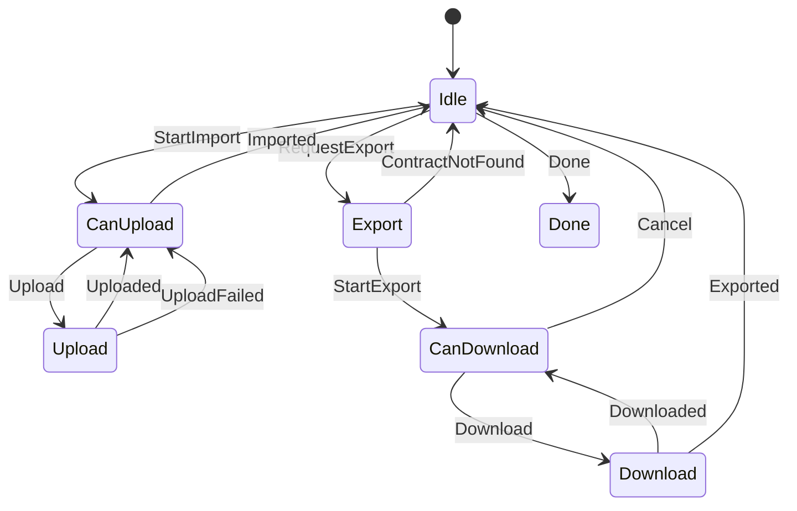

The MarloweTransfer sub-protocol is defined here: 

- **[https://github.com/input-output-hk/marlowe-cardano/blob/main/marlowe-runtime/contract-api/Language/Marlowe/Protocol/Transfer/Types.hs](https://github.com/input-output-hk/marlowe-cardano/blob/main/marlowe-runtime/contract-api/Language/Marlowe/Protocol/Transfer/Types.hs)**

Below is a state diagram for the MarloweLoad sub-protocol: 

The MarloweTransfer sub-protocol is used to efficiently transfer contracts to
and from the contract store. It uses the [object bundle format](../../../platform-and-architecture/object-format.md)
and works in `import` or `export` mode.

### Sub-protocol states

| Protocol state | Agency | Description |
| --- | --- | --- |
| 1. `Idle` | `Client` | The server is waiting for the client to start an upload or a download. |
| 2. `Export` | `Server` | The server is determining if the requested contract can be exported. |
| 3. `CanDownload` | `Client` | The client can download the next partial object bundle from the server. |
| 4. `Download` | `Server` | The server is retrieving the next partial object bundle for the client. |
| 5. `CanUpload` | `Client` | The client can upload the next partial object bundle to the server. |
| 6. `Upload` | `Server` | The server is processing a partial object bundle from the client. |
| 7. `Done` | `Nobody` | The protocol session is done. |

### Messages

| Message | Begin state | End state | Parameter | Description |
| --- | --- | --- | --- | --- |
| 1. `StartImport` | `Idle` | `CanUpload` |  | The client starts an import session. |
| 2. `RequestExport hash` | `Idle` | `Export` |  | The client requests an export of the contract identified by its hash. |
| | | | `hash` | The hash of the contract to export. |
| 3. `StartExport` | `Export` | `CanDownload` |  | The server has verified the export request and cleared the client to begin downloading. |
| 4. `ContractNotFound` | `Export` | `Idle` |  | The server was unable to find the given contract and is refusing the export request. |
| 5. `Done` | `Idle` | `Done` |  | The client ends the session. |
| 6. `Upload bundlePart` | `CanUpload` | `Upload` |  | The client uploads the next part of the bundle to the server. |
| | | | `bundlePart` | The next part of the object bundle that comes after the previous one. |
| 7. `Uploaded mapping` | `Upload` | `CanUpload` |  | The server has processed the uploaded bundle part and is ready for the next one. |
| | | | `mapping` | A mapping of contract labels in the bundle to their hashes (post-merkleization). |
| 8. `UploadFailed err` | `Upload` | `Idle` |  | The client tried to upload an invalid bundle part. |
| | | | `err` | What went wrong while processing the bundle part. |
| 9. `Imported` | `CanUpload` | `Idle` |  | The client has no more bundle parts left to push. |
| 10. `Download n` | `CanDownload` | `Download` |  | The client requests the next n objects in the bundle. |
| | | | `n` | The maximum number of objects the client wants to receive. |
| 11. `Downloaded bundlePart` | `Download` | `CanDownload` |  | The server sends the next bundle part to the client. |
| | | | `bundlePart` | The next part of the object bundle that comes after the previous one. |
| 12. `Exported` | `Download` | `Idle` |  | The server has no more bundle parts to send. |
| 13. `Cancel` | `CanDownload` | `Idle` |  | The client is cancelling the download. |

