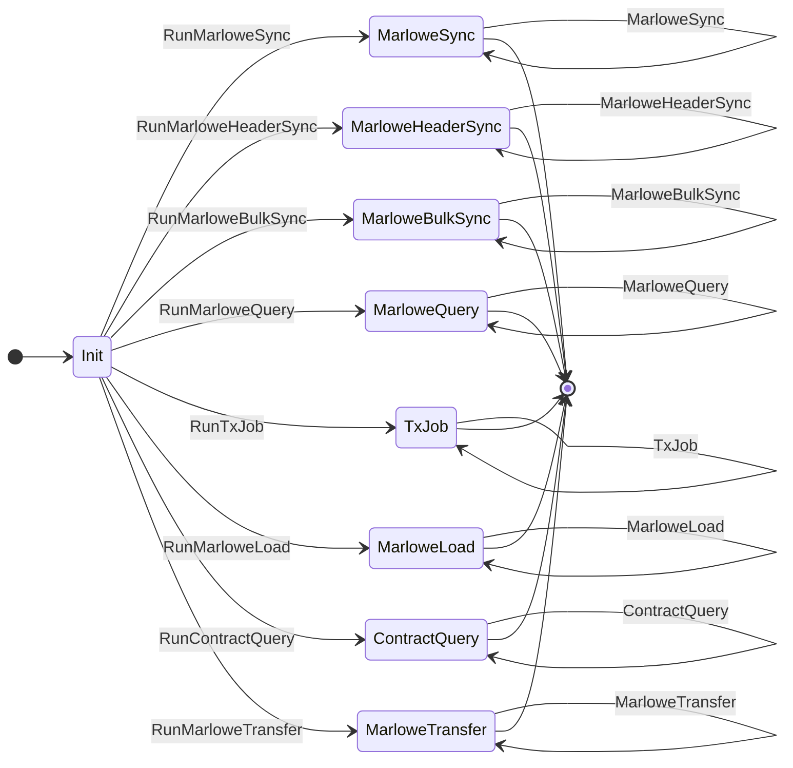

## Introduction

Marlowe Runtime is the application backend for managing Marlowe contracts on the Cardano blockchain. 
The term "Runtime" refers to the whole system, its components, and sub-components. 
Runtime and its protocols and sub-protocols communicate with one another to enable Runtime core functions, which are discovering and querying on-chain Marlowe contracts, and creating Marlowe transactions. 

The Marlowe Runtime protocol enables communicating with Runtime directly. 

These protocols, and specifically this root-level `marlowe-runtime-cli` protocol, is the primary API for Runtime. 
If you want to communicate with Runtime, ultimately, you will be using the `marlowe-runtime-cli` protocol and its sub-protocols. 

In the larger context of working with Runtime, you don't necessarily need to be aware of the protocols to be able to communicate with Runtime. 
For example, if you are using the REST API or Runtime CLI, under the hood, they all communicate with Runtime using this protocol, as does everything that communicates with Runtime. 

### Intended audience

This document is intended for developers who are writing client applications that interact with Runtime. 
You may be writing scripts, command-line tools, servers for DApps that communicate with Runtime, or something similar. 
If you don't want to use the REST API, Runtime CLI, or Marlowe CLI, or any other intermediary, but instead want to connect directly to the TCP socket that Runtime exposes, this document is a useful reference because it describes the behavior, syntax, states, and messages of these protocols. 

## Key concepts

| Concepts | Description |
| --- | --- |
| Peer role | The peer role is either server or client. All protocol sessions take place between two peers -- one server and one client. | 
| Protocol state | A description of the current state of a protocol session. | 
| Peer agency | Describes which peer role is able to send messages to the other in a given protocol state. Agency is exclusive (either server or client has agency, never both). When one peer is able to send a message to the other peer, it has agency. When a peer is in a state of only being able to receive a message, we say it does not have agency. States in which neither peer has agency are terminal states. | 
| Messages | Packets of data that a peer can send to another peer when it has agency. When a message is sent, that event transitions the protocol state from one state to another. | 

### About messages and agency

Certain message types are only available from certain states, and when a peer sends a message to another, it changes the state of the protocol, potentially changing the peer agency also. 
In the majority of cases, agency alternates when a peer sends a message to the other peer. 
For example, the client will send a message to the server, then the server will gain agency. 
Then the server sends a message back to the client and the client will gain agency again. 
There are some cases in which one peer will send multiple messages and keep agency between them, but for the most part it is a back and forth process. 

## Marlowe Runtime protocol

Below is a state diagram for the Marlowe Runtime protocol: 

:::info 

The protocols are all defined using the **[typed-protocols library](https://github.com/input-output-hk/typed-protocols)**. 

:::

The top-level protocol is the Marlowe Runtime protocol. It is defined here: 

- **[https://github.com/input-output-hk/marlowe-cardano/blob/main/marlowe-runtime/proxy-api/Language/Marlowe/Protocol/Types.hs](https://github.com/input-output-hk/marlowe-cardano/blob/main/marlowe-runtime/proxy-api/Language/Marlowe/Protocol/Types.hs)**

### Four sub-protocols

The Marlowe Runtime protocol consists of four sub-protocols: 

1. **[Marlowe Sync](marlowesync-subprotocol.md)**
2. **[Marlowe Header Sync](marloweheadersync-subprotocol.md)**
2. **[Marlowe Bulk Sync](marlowebulksync-subprotocol.md)**
3. **[Marlowe Query](marlowequery-subprotocol.md)** 
4. **[Tx Job](txjob-subprotocol.md)** 
5. **[Marlowe Load](marloweload-subprotocol.md)** 
6. **[Contract Query](contractquery-subprotocol.md)** 
7. **[Marlowe Transfer](marlowetransfer-subprotocol.md)** 

### Client starts session

The client starts a session by sending a message to the server saying which sub-protocol it intends to communicate with, then a protocol session for the sub-protocol begins. 

### Marlowe Runtime protocol states

At any given time, the Marlowe Runtime protocol can be in one of five states: 

1. `Init` 
2. `MarloweSync` 
3. `MarloweHeaderSync` 
4. `MarloweBulkSync` 
5. `MarloweQuery` 
6. `TxJob`  
7. `MarloweLoad`  
8. `ConractQuery`  
9. `MarloweTransfer`  

There is an `init` state, then there is one protocol state per sub-protocol. 
These states transition in a fairly straightforward manner. 

The protocol starts in the `Init` state, and then via one of the message types, it will transition into one of the other states.

Once in that protocol state, the protocol stays there for the rest of the session, communicating in that protocol. 

### Descriptions of the Marlowe Runtime protocol states

| Protocol state | Agency | Parameter | Description |
| --- | --- | --- | --- |
| 1. `Init` | `Client` | | The initial state. |
| 2. `MarloweSync st` | Determined by `st` | | The peers are communicating via the `MarloweSync` sub-protocol. |
| | | `st` | A protocol state from **[MarloweSync](#1-marlowe-sync-sub-protocol)** |
| 3. `MarloweHeaderSync st` | Determined by `st` | | The peers are communicating via the `MarloweHeaderSync` sub-protocol. |
| | | `st` | A protocol state from **[MarloweHeaderSync](#1-marlowe-header-sync-sub-protocol)** |
| 4. `MarloweBulkSync st` | Determined by `st` | | The peers are communicating via the `MarloweBulkSync` sub-protocol. |
| | | `st` | A protocol state from **[MarloweBulkSync](#1-marlowe-bulk-sync-sub-protocol)** |
| 5. `MarloweQuery st` | Determined by `st` | | The peers are communicating via the `Query MarloweSyncRequest` sub-protocol. |
| | | `st` | A protocol state from **[Query MarloweSyncRequest](#1-marlowe-query-sub-protocol)** |
| 6. `TxJob st` | Determined by `st` | | The peers are communicating via the `Job MarloweTxCommand` sub-protocol. |
| | | `st` | A protocol state from **[Job MarloweTxCommand](#1-tx-job-sub-protocol)** |
| 7. `MarloweLoad st` | Determined by `st` | | The peers are communicating via the `MarloweLoad` sub-protocol. |
| | | `st` | A protocol state from **[MarloweLoad](#1-marlowe-load-sub-protocol)** |
| 8. `ContractQuery st` | Determined by `st` | | The peers are communicating via the `Query ContractRequest` sub-protocol. |
| | | `st` | A protocol state from **[Query ContractRequest](#1-contract-query-sub-protocol)** |
| 9. `MarloweTransfer st` | Determined by `st` | | The peers are communicating via the `MarloweTransfer` sub-protocol. |
| | | `st` | A protocol state from **[MarloweTransfer](#1-marlowe-transfer-sub-protocol)** |

### Message types

There are eight message types in the Marlowe Runtime protocol. 
The first seven initiate sub-protocol sessions, while the final seven are carriers for sub-protocol messages. 
For example, the `MarloweSync` message type embeds a message from the sub-protocol in the Marlowe Runtime protocol. 

| Message | Begin state | End state | Parameter | Description |
| --- | --- | --- | --- | --- |
| 1. `RunMarloweSync` | `Init` | `MarloweSync Init` |  | Start a `MarloweSync` session. |
| 2. `RunMarloweHeaderSync` | `Init` | `MarloweHeaderSync Idle` |  | Start a `MarloweHeaderSync` session. |
| 3. `RunMarloweBulkSync` | `Init` | `MarloweBulkSync Idle` |  | Start a `MarloweBulkSync` session. |
| 4. `RunMarloweQuery` | `Init` | `MarloweQuery Req` |  | Start a `MarloweQuery` session. |
| 5. `RunTxJob` | `Init` | `TxJob Init` |  | Start a `TxJob` session. |
| 6. `RunMarloweLoad` | `Init` | `MarloweLoad (Processing RootNode)` |  | Start a `MarloweLoad` session. |
| 7. `RunContractQuery` | `Init` | `ContractQuery Req` |  | Start a `ContractQuery` session. |
| 8. `RunMarloweTransfer` | `Init` | `MarloweTransfer Idle` |  | Start a `MarloweTransfer` session. |
| 9. `MarloweSync msg` | `MarloweSync st` | `MarloweSync st'` |  | Wrap a `MarloweSync` message. |
| | | | `msg` | A `MarloweSync` message with begin state `st` and end state `st'` |
| 10. `MarloweHeaderSync msg` | `MarloweHeaderSync st` | `MarloweHeaderSync st'` |  | Wrap a `MarloweHeaderSync` message. |
| | | | `msg` | A `MarloweHeaderSync` message with begin state `st` and end state `st'` |
| 11. `MarloweBulkSync msg` | `MarloweBulkSync st` | `MarloweBulkSync st'` |  | Wrap a `MarloweBulkSync` message. |
| | | | `msg` | A `MarloweBulkSync` message with begin state `st` and end state `st'` |
| 12. `MarloweQuery msg` | `MarloweQuery st` | `MarloweQuery st'` |  | Wrap a `MarloweQuery` message. |
| | | | `msg` | A `MarloweQuery` message with begin state `st` and end state `st'` |
| 13. `TxJob msg` | `TxJob st` | `TxJob st'` |  | Wrap a `Job MarloweTxCommand` message. |
| | | | `msg` | A `TxJob` message with begin state `st` and end state `st'` |
| 14. `MarloweLoad msg` | `MarloweLoad st` | `MarloweLoad st'` |  | Wrap a `Job MarloweTxCommand` message. |
| | | | `msg` | A `MarloweLoad` message with begin state `st` and end state `st'` |
| 15. `ContractQuery msg` | `ContractQuery st` | `ContractQuery st'` |  | Wrap a `Job MarloweTxCommand` message. |
| | | | `msg` | A `ContractQuery` message with begin state `st` and end state `st'` |
| 16. `MarloweTransfer msg` | `MarloweTransfer st` | `MarloweTransfer st'` |  | Wrap a `Job MarloweTxCommand` message. |
| | | | `msg` | A `MarloweTransfer` message with begin state `st` and end state `st'` |

### Binary format for sending messages over TCP

Use the binary format for the Marlowe Runtime protocol to send messages over TCP. 
The binary format describes how each message type is converted into binary data, then read and decoded. 

At this time, Haskell is the only supported language that has the functions for this. 

If you are using Haskell, use the **[Marlowe client library](https://github.com/input-output-hk/marlowe-cardano/tree/main/marlowe-client)**, one of our libraries in our marlowe-cardano repo. It exports a monad transformer called `MarloweT` that enables you to run a client of the Marlowe Runtime protocol. Run that monad transformer by providing the port number and host address of Runtime and it will connect to it and handle the binary format for you. 

## Messaging behavior

On a functional level, the Marlowe Runtime protocol multiplexes the four sub-protocols into one. 
The client always sends one of these eight message types (`RunMarloweSync`, `RunMarloweHeaderSync`, `RunMarloweBulkSync`, `RunMarloweQuery`, `RunTxJob`, `RunMarloweLoad`, `RunContractQuery`, `RunMarloweTransfer`) to start. 
Depending on which one it started the session with, it will then continuously send that message type between client and server. 
If it starts with `RunMarloweSync`, the client and server will then just exchange `MarloweSync` messages back and forth. 
Inside each of those is a message from the underlying `MarloweSync` protocol. 
When finished, it disconnects and the session is over. 

## About the Haskell source files

There is a data structure in the Haskell source files that describes the different protocol states. 
There is a message type that shows what all the available messages are for that protocol. 
Each message indicates the initial state of the message. 
For example, `RunMarloweSync` starts in the state `StInit`, then transitions into the `MarloweSync.StInit` state. 
