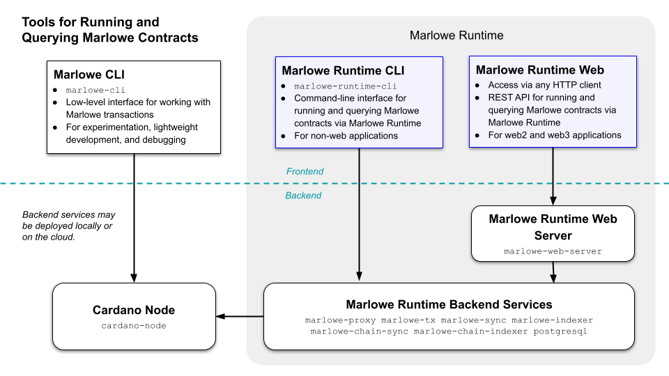

### Marlowe Runtime

* Orchestrates off-chain operation of Marlowe contracts.
* Small, nearly stateless components.
* Typed protocols.
* Multiple clients:
> * Command line
> * REST webserver

### Marlowe CLI: high Level

* Supports a straightforward workflow for users that just want to run contracts from the command line.
* Hides details of input and state of Marlowe contracts.
* Hides and automates many aspects of Plutus and interaction with the Cardano node.
* Focuses on the Marlowe contract.

### Marlowe CLI: low Level

* Supports developer workflows for debugging and fine-grained control of each atomic operation involved in running Marlowe contracts.
* Controls modification of Marlowe state and construction of Marlowe input.
* Controls construction and submission of validators, datums, and redeemers.
* Focus on the mechanics of Marlowe on Plutus and Cardano.
