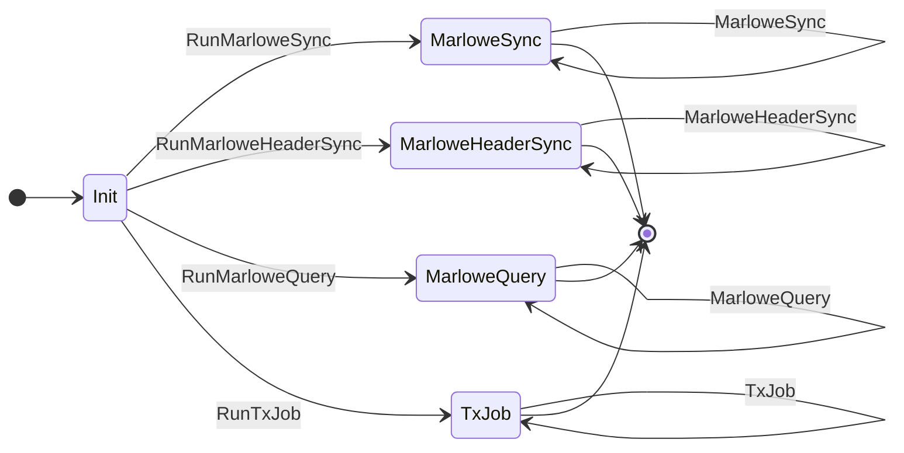
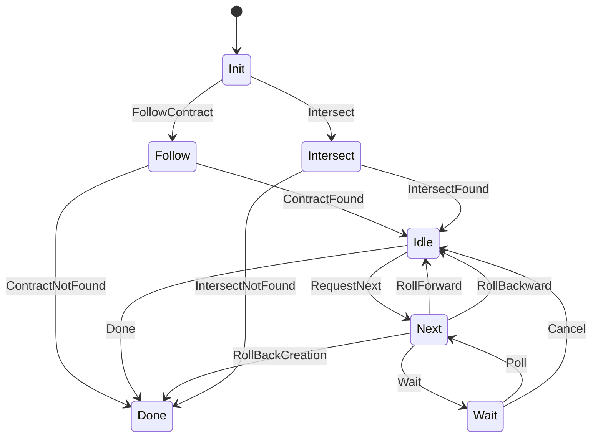

> NOTE: Draft in progress

> * Add code examples

## Introduction

Marlowe Runtime is the application backend for managing Marlowe contracts on the Cardano blockchain. 
The term "Runtime" refers to the whole system, its components and sub-components. 
The Runtime and its protocols and sub-protocols communicate with one another to enable the Runtime's core functions, which are discovering and querying on-chain Marlowe contracts, and creating Marlowe transactions. 

The Marlowe Runtime protocol enables communicating with the Runtime directly. 

These protocols, and specifically this root-level `marlowe-runtime-cli` protocol, is the primary API for the Runtime. 
If you want to communicate with the Runtime, ultimately, you will be using the `marlowe-runtime-cli` protocol and its sub-protocols. 

In the larger context of working with the Runtime, you don't necessarily need to be aware of the protocols to be able to communicate with the Runtime. 
For example, if you are using the REST API or Runtime CLI, under the hood, they all communicate with the Runtime using this protocol, as does everything that communicates with the Runtime. 

### Intended audience

This document is intended for developers who are writing client applications that interact with the Runtime. 
You may be writing scripts, command-line tools, servers for DApps that communicate with the Runtime, or something similar. 
If you don't want to use the REST API, Runtime CLI or Marlowe CLI, or any other intermediary, but instead want to connect directly to the TCP socket that the Runtime exposes, this document is a useful reference because it describes the behavior and syntax of these protocols, their states and messages. 

## Key concepts

| Concepts | Description |
| --- | --- |
| Peer Role | The peer role is either server or client. All protocol sessions take place between two peers -- one server and one client. | 
| Protocol State | A description of the current state of a protocol session. | 
| Peer Agency | Describes which peer role is able to send messages to the other in a given protocol state. Agency is exclusive (either server or client has agency, never both). When one peer is able to send a message to the other peer, it has agency. When a peer is in a state of only being able to receive a message, we say it does not have agency. States in which neither peer has agency are terminal states. | 
| Messages | Packets of data that a peer can send to another peer when it has agency. When a message is sent, that event transitions the protocol state from one state to another state. | 

### About messages and agency

Certain message types are only available from certain states, and when a peer sends a message to the other peer, it changes the state of the protocol, potentially changing the peer agency as well. 
In the majority of cases, agency alternates when a peer sends a message to the other peer. 
For example, the client will send a message to the server, then the server will gain agency. 
Then the server sends a message back to the client and the client will gain agency again. 
There are some cases in which one peer will send multiple messages and keep agency between them, but for the most part it is a back and forth process. 

## Marlowe Runtime protocol

> NOTE: Need to install a Mermaid library to display diagram correctly. 

Below is a state diagram for the Marlowe Runtime protocol: 

> NOTE: The protocols are all defined using the [typed-protocols library](https://github.com/input-output-hk/typed-protocols). 

The top-level protocol is the Marlowe Runtime protocol. It is defined here: 

* [https://github.com/input-output-hk/marlowe-cardano/blob/main/marlowe-runtime/proxy-api/Language/Marlowe/Protocol/Types.hs](https://github.com/input-output-hk/marlowe-cardano/blob/main/marlowe-runtime/proxy-api/Language/Marlowe/Protocol/Types.hs)

### Four sub-protocols

The Marlowe Runtime protocol consists of four sub-protocols: 

1. Marlowe Sync 
2. Marlowe Header Sync 
3. Marlowe Query 
4. Tx Job 

### Client starts session

The Client starts a session by sending a message to the server saying which sub-protocol it intends to communicate with, then a protocol session for the sub-protocol begins. 

### Marlowe Runtime protocol states

At any given time, the Marlowe Runtime protocol can be in one of five states: 

1. `Init` 
2. `MarloweSync` 
3. `MarloweHeaderSync` 
4. `MarloweQuery` 
5. `TxJob`  

There is an `init` state, then there is one protocol state per sub-protocol. 
These states transition in a fairly straightforward manner. 

The protocol starts in the `Init` state, and then via one of the message types, it will transition into either the `MarloweSync`, the `MarloweHeaderSync`, the `MarloweQuery` or the `TxJob` state. 

Once in that protocol state, the protocol stays there for the rest of the session, communicating in that protocol. 

### Descriptions of the Marlowe Runtime protocol states

| Protocol state | Agency | Parameter | Description |
| --- | --- | --- | --- |
| 1. `Init` | `Client` | | The initial state. |
| 2. `MarloweSync st` | Determined by `st` | | The peers are communicating via the `MarloweSync` sub-protocol. |
| | | `st` | A protocol state from [MarloweSync](#1-marlowe-sync-sub-protocol) |
| 3. `MarloweHeaderSync st` | Determined by `st` | | The peers are communicating via the `MarloweHeaderSync` sub-protocol. |
| | | `st` | A protocol state from [MarloweHeaderSync](#1-marlowe-header-sync-sub-protocol) |
| 4. `MarloweQuery st` | Determined by `st` | | The peers are communicating via the `MarloweQuery` sub-protocol. |
| | | `st` | A protocol state from [MarloweQuery](#1-marlowe-query-sub-protocol) |
| 5. `TxJob st` | Determined by `st` | | The peers are communicating via the `Job MarloweTxCommand` sub-protocol. |
| | | `st` | A protocol state from [Job MarloweTxCommand](#1-tx-job-sub-protocol) |

### Eight message types

There are eight message types in the Marlowe Runtime protocol. 
The first four message types initiate sub-protocol sessions. 
The final four are carriers for sub-protocol messages. 
For example, the `MarloweSync` message type embeds a message from the sub-protocol in the Marlowe Runtime protocol. 

| Message | Begin State | End State | Parameter | Description |
| --- | --- | --- | --- | --- |
| 1. `RunMarloweSync` | `Init` | `MarloweSync Init` |  | Start a `MarloweSync` session. |
| 2. `RunMarloweHeaderSync` | `Init` | `MarloweHeaderSync Idle` |  | Start a `MarloweHeaderSync` session. |
| 3. `RunMarloweQuery` | `Init` | `MarloweQuery Req` |  | Start a `MarloweQuery` session. |
| 4. `RunTxJob` | `Init` | `TxJob Init` |  | Start a `TxJob` session. |
| 5. `MarloweSync msg` | `MarloweSync st` | `MarloweSync st'` |  | Wrap a `MarloweSync` message. |
| | | | `msg` | A `MarloweSync` message with begin state `st` and end state `st'` |
| 6. `MarloweHeaderSync msg` | `MarloweHeaderSync st` | `MarloweHeaderSync st'` |  | Wrap a `MarloweHeaderSync` message. |
| | | | `msg` | A `MarloweHeaderSync` message with begin state `st` and end state `st'` |
| 7. `MarloweQuery msg` | `MarloweQuery st` | `MarloweQuery st'` |  | Wrap a `MarloweQuery` message. |
| | | | `msg` | A `MarloweQuery` message with begin state `st` and end state `st'` |
| 8. `TxJob msg` | `TxJob st` | `TxJob st'` |  | Wrap a `Job MarloweTxCommand` message. |
| | | | `msg` | A `TxJob` message with begin state `st` and end state `st'` |

### Binary format for sending messages over TCP

Use the binary format for the Marlowe Runtime protocol to send messages over TCP. 
The binary format describes how each message type is converted into binary data, then read and decoded. 

At this time, Haskell is the only supported language that has the functions for this. 

If you are using Haskell, use the [Marlowe client library](https://github.com/input-output-hk/marlowe-cardano/tree/main/marlowe-client), one of our libraries in our marlowe-cardano repo. It exports a monad transformer called `MarloweT` that enables you to run a client of the Marlowe Runtime protocol. Run that monad transformer by providing the port number and host addresss of the Runtime and it will connect to it and handle the binary format for you. 

## Messaging behavior

On a functional level, the Marlowe Runtime protocol multiplexes the four sub-protocols into one. 
The client always sends one of these four message types (`RunMarloweSync`, `RunMarloweHeaderSync`, `RunMarloweQuery`, `RunTxJob`) to start. 
Depending on which one it started the session with, it will then continuously send that message type between client and server. 
If it starts with `RunMarloweSync`, the client and server will then just exchange `MarloweSync` messages back and forth. 
Inside each of those is a message from the underlying `MarloweSync` protocol. 
When finished, it disconnects and the session is over. 

## About the Haskell source files

There is a data structure in the Haskell source files that describes the different states of the protocol. 
There is a message type that shows what all the available messages are for that protocol. 
Each message indicates the initial state of the message. 
For example, `RunMarloweSync` starts in the state `StInit`, then transitions into the `MarloweSync.StInit` state. 

> For more detailed documentation about the typed protocol framework, please see: [Network.TypedProtocol.Core documentation](https://input-output-hk.github.io/ouroboros-network/typed-protocols/Network-TypedProtocol-Core.html). 

## 1. MarloweSync sub-protocol

The MarloweSync sub-protocol is defined here: 

* [https://github.com/input-output-hk/marlowe-cardano/blob/main/marlowe-runtime/history-api/Language/Marlowe/Protocol/Sync/Types.hs](https://github.com/input-output-hk/marlowe-cardano/blob/main/marlowe-runtime/history-api/Language/Marlowe/Protocol/Sync/Types.hs)

> NOTE: Need to install a Mermaid library to display diagram correctly. 

Below is a state diagram for the MarloweSync sub-protocol: 

The MarloweSync sub-protocol is used to synchronize the history of a specific Marlowe contract.
The client receives a stream of blocks, the first of which contains a "create step", with subsequent blocks containing one or more "contract step(s)". 
A create step is information related to the contract creation transaction.
A contract step is either an "apply inputs" step with an apply inputs transaction that advances the contract, or a "withdraw" step where funds paid by the contract are withdrawn from the payout validator.

### Sub-protocol states

| Protocol state | Agency | Parameter | Description |
| --- | --- | --- | --- |
| 1. `Init` | `Client` | | The initial state. |
| 2. `Follow` | `Server` | | The server is processing a request to follow a contract. |
| 3. `Done` | `Nobody` | | The terminal state. |
| 4. `Idle v` | `Client` | | A contract is being followed, the server is waiting for the client to send a message. |
| | | `v` | The version of the Marlowe contract |
| 5. `Next v` | `Server` | | The server is looking up the next block that contain contract steps. |
| | | `v` | The version of the Marlowe contract |
| 6. `Wait v` | `Client` | | The client has reached the last block with steps for the current contract and is waiting for a new block to arrive. |
| | | `v` | The version of the Marlowe contract |
| 7. `Intersect v` | `Server` | | The server is processing an intersect request for a contract. |
| | | `v` | The version of the Marlowe contract |

### Messages

| Message | Begin State | End State | Parameter | Description |
| --- | --- | --- | --- | --- |
| 1. `FollowContract id` | `Init` | `Follow` |  | Follow a contract by id. |
| | | | `id` | The ID of the contract to follow (i.e. the tx-in that created the contract |
| 2. `ContractNotFound` | `Follow` | `Done` |  | The requested contract could not be found. |
| 3. `ContractFound blk v create` | `Follow` | `Idle v` |  | The requested contract was found. |
| | | | `blk` | The block header of the block that contains the creation transaction. |
| | | | `v` | The version of contract. |
| | | | `create` | The create step for the contract. |
| 4. `Done` | `Idle v` | `Done` |  | Ends the session. |
| 5. `RequestNext` | `Idle v` | `Next v` |  | Request the next block of contract steps. |
| 6. `RollForward blk steps` | `Next v` | `Idle v` |  | The server sends the next block of steps.
| | | | `blk` | The block header of the block that contains the new steps. |
| | | | `steps` | The (non-empty) list of steps in this block, in order. |
| 7. `RollBackward blk` | `Next v` | `Idle v` |  | The server is rolling the client back to a previous block. |
| | | | `blk` | The block header of the block that the client is now at. |
| 8. `RollBackCreation` | `Next v` | `Done` |  | The creation transaction was rolled back - the contract no longer exists. |
| 9. `Wait` | `Next v` | `Wait v` |  | There are no more blocks with steps for this contract. The client can wait for new ones. |
| 10. `Poll` | `Wait v` | `Next v` |  | The client is checking if new blocks are available. |
| 11. `Cancel` | `Wait v` | `Idle v` |  | The client does not wish to wait indefinitely for new blocks to arrive. |
| 12. `Intersect id v blks` | `Init` | `Intersect v` |  | Send a request to start syncing from a known point in a contract's history. |
| | | | `id` | The id of the contract to intersect with. |
| | | | `v` | The expected version of the contract. |
| | | | `blks` | A list of blocks in the contract's history which the client has record of. Must be a contiguous subset of blocks (none skipped) in increasing order. |
| 13. `IntersectFound blk` | `Intersect v` | `Idle v` |  | The server found a matching block for this contract and will resume syncing from that point. |
| | | | `blk` | The greatest common block the server knows about in the blocks provided by the client. |
| 13. `IntersectNotFound` | `Intersect v` | `Done` |  | The server could not find an intersection with the client. Either the contract was not found, no points matched, or the version was wrong. |

## 2. MarloweHeaderSync sub-protocol

The MarloweHeaderSync sub-protocol is defined here: 

* [https://github.com/input-output-hk/marlowe-cardano/blob/main/marlowe-runtime/discovery-api/Language/Marlowe/Protocol/HeaderSync/Types.hs](https://github.com/input-output-hk/marlowe-cardano/blob/main/marlowe-runtime/discovery-api/Language/Marlowe/Protocol/HeaderSync/Types.hs)

The MarloweHeaderSync sub-protocol is used to synchronize contract creation transactions. 
The client receives a stream of blocks, each of which contains one or more "contract header(s)". 
A contract header contains minimal information about a transaction that creates a new Marlowe contract. 

This is like the "subscribe to all of the contracts" protocol. 
This is what you would use to stay synchronized with the contracts on-chain. 
As the chain advances, and as new contracts are found, it will deliver them to the client. 

### Sub-protocol states

| Protocol state | Agency | Description |
| --- | --- | --- |
| 1. `Idle` | `Client` | The initial state. | 
| 2. `Intersect` | `Server` | When the client asks the server to fast-forward to a known chain point. | 
| 3. `Next` | `Server` | When the client asks the server to provide the next block of contract headers. | 
| 4. `Wait` | `Client` | When the server has no more blocks to send (i.e., the client has reached the tip of the chain). | 
| 5. `Done` | `Nobody` | The terminal state. | 

### The Intersect state 

The intersect is when the client asks the server to fast forward to a known chain point. 
For example, in a situation where the client has already done a fair amount of synchronization, and then quits, when it starts up again, rather than starting over from genesis, it can instead start from the point where it last left off. 
The Intersect is the server recognizing a point that both it and the client know about, then starting from there. 
On the other hand, if the server does not or cannot recognize what the client is referencing, it will start from the beginning of the chain (from genesis). 

### MarloweHeaderSync sub-protocol messages

| Message | Begin State | End State | Parameter | Description |
| --- | --- | --- | --- | --- |
| 1. `RequestNext` | `Idle` | `Next` | | The client requests the next block of headers from the server. |
| 2. `NewHeaders blk headers` | `Next` | `Idle` | | The server sends the next block of headers to the client. |
| | | | `blk` | A block header (the block to which the server has advanced the client) |
| | | | `headers` | A list of contract headers that appear in that block. |
| 3. `RollBackward point` | `Next` | `Idle` | | The client's current position was rolled back, the server tells the client of the point to which it was rolled back. |
| | | | `point` | Chain point (either a block header or Genesis if the chain has rolled all the way back to Genesis). |
| 4. `Wait` | `Next` | `Wait` | | The client is at the chain tip. There are no more Marlowe contract headers to send. The client may choose to wait and poll until more are available. |
| 5. `Poll` | `Wait` | `Next` | | The client is checking with the server to find out if there are new headers available. |
| 6. `Cancel` | `Wait` | `Idle` | | The client doesn't wish to wait, and returns to the idle state. Usually, when you send a `cancel`, in nearly all cases, it is followed by a `done` message. This is the case for clients that are only concerned about getting everything that is currently on the chain. Once that point is reached, when it reaches the tip, it communicates `done`. |
| 7. `Done` | `Idle` | `Done` | | Terminate the session. |
| 8. `Intersect blks` | `Idle` | `Intersect` | | The client tells the server which blocks it has already seen so that the server can start syncing from an appropriate point in the chain. |
| | | | `blks` | A contiguous list of block headers in ascending order. These block headers represent the most recent blocks from the client' chain. |
| 9. `IntersectFound blk` | `Intersect` | `Idle` | | The server has found an intersection point with the client and will start syncing *after* this point (i.e., the next `NewHeaders` message will be after this block). |
| | | | `blk` | The most recent block contained in both the client's chain and the server's chain. |
| 10. `IntersectNotFound` | `Intersect` | `Idle` | |The server was unable to find an intersection point with the client and will start syncing from Genesis. |

## 3. MarloweQuery sub-protocol

The MarloweQuery sub-protocol is defined here: 

* [https://github.com/input-output-hk/marlowe-cardano/blob/main/marlowe-runtime/sync-api/Language/Marlowe/Protocol/Query/Types.hs](https://github.com/input-output-hk/marlowe-cardano/blob/main/marlowe-runtime/sync-api/Language/Marlowe/Protocol/Query/Types.hs)

The `MarloweQuery` protocol allows clients to query the current state of on-chain Marlowe contracts.

### Sub-protocol states

| Protocol state | Agency | Parameter | Description |
| --- | --- | --- | --- |
| 1. `Req` | `Client` | | The client is preparing a request to send. |
| 2. `Res a` | `Server` | | The server handling a request from the client. |
| | | `a` | The type of the response. |
| 3. `Done` | `Nobody` | | The terminal state. |

### MarloweQuery sub-protocol messages

| Message | Begin State | End State | Parameter | Description |
| --- | --- | --- | --- | --- |
| 1. `Request req` | `Req` | `Res a` |  | Send a request to the server. |
| | | | `req` | A request with a result of type `a`. |
| 2. `Respond a` | `Res a` | `Req` |  | Send a response to the client. |
| | | | `a` | The response. |
| 3. `Done` | `Req` | `Done` |  | Terminate the session. |

### Request Types

The `Request` message type accepts a request payload which has an associated
result type. The following requests are supported:

| Request | Parameter | Description |
| --- | --- | --- |
| `ContractHeaders filter range` |  | Returns a page of contract headers, or Nothing if the range specified an invalid start point. |
|  | `filter` | A list of tags to and a list of role token currencies to limit the results. |
|  | `range` | The ID of the contract to start from, offset, size, and sort direction that describes the page to fetch. |
| `ContractState id` |  | Returns the current state of a contract by its ID. |
|  | `id` | The ID of the contract. |
| `Transactions id` |  | Returns the apply inputs transaction of a contract by its ID. |
|  | `id` | The ID of the contract. |
| `Transaction id` |  | Returns an apply inputs transaction by its ID. |
|  | `id` | The ID of the transaction. |
| `Withdrawals filter range` |  | Returns a page of withdrawal transactions, or Nothing if the range specified an invalid start point. |
|  | `filter` | A list of role token currencies to limit the results. |
|  | `range` | The ID of the withdrawal to start from, offset, size, and sort direction that describes the page to fetch. |
| `Withdrawal id` |  | Returns a withdraw transaction by its ID. |
|  | `id` | The ID of the withdraw transaction. |
| `Both req1 req2` |  | Run two requests in parallel and return the results from both. |
|  | `req1` | The first request. |
|  | `req2` | The second request. |

## 4. TxJob sub-protocol

The TxJob protocol is defined in two places. It is an instance of the generic Job protocol, which is a protocol that allows jobs to be run and their progress to be monitored. It is parameterized by the set of commands it supports. `marlowe-tx` has a set of commands called `MarloweTxCommand`.

The TxJob sub-protocol is defined here: 

* [marlowe-runtime/tx-api/Language/Marlowe/Runtime/Transaction/Api.hs](https://github.com/input-output-hk/marlowe-cardano/blob/main/marlowe-runtime/tx-api/Language/Marlowe/Runtime/Transaction/Api.hs)

  - The `MarloweTxCommand` type describes the available commands for marlowe-tx.

It is also defined in `marlowe-protocols/src/Network/Protocol/Job/Types.hs`

  - Defines the generic job protocol (command agnostic). 

### Sub-protocol states

| Protocol state | Agency | Parameter | Description |
| --- | --- | --- | --- |
| 1. `Init` | `Client` | | The initial state. |
| 2. `Cmd status err res` | `Server` | | The server has received a command and is preparing a job status update for the client. |
| | | `status` | The type of progress the job reports in status updates. |
| | | `err` | The type of errors the job can fail with. |
| | | `res` | The result type of the job when it completes successfully. |
| 3. `Attach status err res` | `Server` | | The server is processing a request to attach to an already running job. |
| | | `status` | The type of progress the job reports in status updates. |
| | | `err` | The type of errors the job can fail with. |
| | | `res` | The result type of the job when it completes successfully. |
| 4. `Await status err res` | `Client` | | The client is waiting for the job to complete. |
| | | `status` | The type of progress the job reports in status updates. |
| | | `err` | The type of errors the job can fail with. |
| | | `res` | The result type of the job when it completes successfully. |
| 5. `Done` | `Nobody` | | The terminal state. |

### Job sub-protocol messages

| Message | Begin State | End State | Parameter | Description |
| --- | --- | --- | --- | --- |
| 1. `Exec cmd` | `Init` | `Cmd status err res` |  | Request the server to execute a command. |
| | | | `cmd` | A command with status type `status`, error type `err`, and result type `res` |
| 2. `Attach id` | `Init` | `Attach status err res` |  | Request to attach to running job by its ID. |
| | | | `id` | The ID of the job to attach to, with status type `status`, error type `err`, and result type `res` |
| 3. `Attached` | `Attach status err res` | `Cmd status err res` |  | The server has found the requested job and has attached the client to it. |
| 4. `AttachFailed` | `Attach status err res` | `Done` |  | The server could not find the requested job or is refusing to attach the client to it. |
| 5. `Fail err` | `Cmd status err res` | `Done` |  | The job has failed. |
| | | | `err` | The error which caused the job to fail. |
| 6. `Succeed res` | `Cmd status err res` | `Done` |  | The job has completed successfully. |
| | | | `res` | The result of the job. |
| 7. `Await status id` | `Cmd status err res` | `Await status err res` |  | The job is not complete and the server is providing a status update to the client. |
| | | | `status` | The progress of the job. |
| | | | `id` | The ID of the job so the client can attach to it later if it wants to. |
| 8. `Poll` | `Await status err res` | `Cmd status err res` |  | Request a status update from the server. |
| 9. `Detach` | `Await status err res` | `Done` |  | Detach from the job and terminate the session. |

### `MarloweTxCommand` commands

| Command | Status | Error | Result | Parameter | Description |
| --- | --- | --- | --- | --- | --- |
| 1. `Create` | none | `CreateError` | `ContractCreated` | | Build a transaction which starts a new Marlowe contract. |
|  | | | | `stakeCredential` | An optional stake credential to attach to the script address for this contract. |
|  | | | | `v` | The version of the contract. |
|  | | | | `wallet` | A `WalletAddresses` record of the wallet authorizing the transaction. |
|  | | | | `roles` | A `RoleTokensConfig` that describes how role tokens are to be minted and distributed in this contract. |
|  | | | | `metadata` | A `MarloweTransactionMetadata` record to attach to the transaction's metadata. |
|  | | | | `minAdaDeposit` | The min ADA deposit for the contract. See (insert link to min ADA deposit here). |
|  | | | | `contract` | The Marlowe contract to run. |
| 2. `ApplyInputs` | none | `ApplyInputsError` | `InputsApplied` | | Build a transaction which applies inputs to a running Marlowe contract. |
|  | | | | `v` | The version of the contract. |
|  | | | | `wallet` | A `WalletAddresses` record of the wallet authorizing the transaction. |
|  | | | | `contractID` | The ID of the contract to apply the inputs to. |
|  | | | | `metadata` | A `MarloweTransactionMetadata` record to attach to the transaction's metadata. |
|  | | | | `invalidBefore` | An optional date + time in UTC before with the transaction is invalid. If omitted, the server will compute a sensible default. |
|  | | | | `invalidHereafter` | An optional date + time in UTC that describes the point when the transaction is no longer valid (inclusive). If omitted, the server will compute a sensible default. |
|  | | | | `inputs` | A list of inputs to apply to the contract. |
| 3. `Withdraw` | none | `WithdrawError` | `TxBody BabbageEra` | | Build a transaction which withdraws funds paid to a role by a contract. |
|  | | | | `v` | The version of the contract. |
|  | | | | `wallet` | A `WalletAddresses` record of the wallet authorizing the transaction. Funds will be sent to the change address. |
|  | | | | `contractID` | The ID of the contract whose role token currency to withdraw from. |
|  | | | | `role` | The role to withdraw funds for. The wallet must contain a UTxO with a valid role token for this role and contract. |
| 4. `Submit` | `SubmitStatus` | `WithdrawError` | `TxBody BabbageEra` | | Submit a transaction to the upstream node and wait for confirmation. |
|  | | | | `tx` | A babbage transaction to submit to the upstream node. |

Note: The first three commands have no status type (technically their status type is the uninhabited type `Void`). This means that a client will never be told to wait for a response - they will either receive a `Fail` or a `Success`. It also means that these commands have no job IDs, and hence cannot be attached to.

For more details on the types mentioned above, please see:

* [marlowe-runtime/tx-api/Language/Marlowe/Runtime/Transaction/Api.hs](https://github.com/input-output-hk/marlowe-cardano/blob/main/marlowe-runtime/tx-api/Language/Marlowe/Runtime/Transaction/Api.hs)

