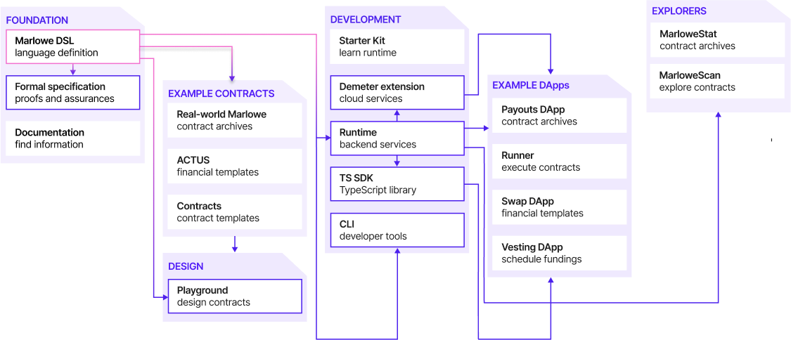

Provides the resources for users to design, validate, and deploy financial smart contracts. Enables coding in a domain-specific language, simulating contracts in the Playground, and executing them with various development tools. Ensures safety through rigorous testing and formal proofs, and accommodating both novice and expert users for a wide range of use cases. Offers example contracts and prototype DApps for customization.

