This tutorial will demonstrate a **monolithic** workflow in Marlowe. Monolithic refers to all the inputs passed to `marlowe-cli` transformed to a JSON file then parsed as a transaction. `cardano-cli` will be used to query the state of the transaction.

There will cover these main topics:
 - Getting and passing all the inputs needed for `marlowe-cli contract marlowe`
 - Parsing the Marlowe JSON file to create a transaction with `marlowe-cli transaction`
 - Obtaining and retuning testnet ADA from the faucet

```mermaid
flowchart LR
    A([Mainnet or Testnet])-. --testnet-magic .-> G[marlowe-cli contract marlowe]
    B([Stake Address])-. --stake-address .-> G
    C([Currency for Roles])-. --roles-currency .-> G
    D["📁 Marlowe Contract JSON File"] --> | --contract-file | G
    E["📁 Marlowe State JSON File"] --> | --state-file | G
    F["📁 Marlowe Inputs JSON File"]-. --inputs-file .-> G
    H["📁 Marlowe JSON File"] --> I[jq]
    G-- "--out-file" -->H
    H --> I([Validator Address])
    H --> J["📁 Marlowe Validator Plutus File"]
    H --> K["📁 Marlowe Datum JSON File"]
    H --> L([Marlowe Datum Hash])
    H --> M["📁 Marlowe Redeemer JSON File"]
    N([Minimum Slot]) --> | --invalid-before | P[marlowe-cli transaction]
    O([Maximum Slot]) --> | --invalid-herafter | P
    I --> | --script-address | P
    J --> | --tx-in-script-file | P
    K --> | --tx-in-datum-file | P
    M --> | --tx-in-redeemer-file| P
    P-- "--out-file" -->Q[Tx Body File]
```



## Prerequisites

An installation of the following tools is required:

 - `marlowe-cli`
 - `cardano-cli`
 - `jq`

This tutorial will require a setup of the Cardano node through docker compose shown in [Deploy Marlowe Runtime](deploy-marlowe-runtime).

Alternatively, start a Nix shell from the marlowe-cardano repo which will have all of the tools installed in addition to examples for Jupyter notebooks.

## Set the node socket and testnet

```bash
export CARDANO_NODE_SOCKET_PATH=$(docker volume inspect marlowe-starter-kit_shared | jq -r '.[0].Mountpoint')/node.socket

f=$(dirname $CARDANO_NODE_SOCKET_PATH)
while [[ $f != / ]]; do sudo chmod a+rx "$f"; f=$(dirname "$f"); done
sudo chmod a+rwx $CARDANO_NODE_SOCKET_PATH
```

Using the preprod testnet, set the environment variable:

```bash
export CARDANO_TESTNET_MAGIC=1
```

## Wallet

```bash
PAYMENT_SKEY=payment.skey
PAYMENT_VKEY=payment.vkey

if [[ ! -e "$PAYMENT_SKEY" ]]
then
  cardano-cli address key-gen \
    --signing-key-file "$PAYMENT_SKEY" \
    --verification-key-file "$PAYMENT_VKEY"
fi   
```

```bash
PAYMENT_ADDR=$(cardano-cli address build --testnet-magic "$CARDANO_TESTNET_MAGIC" --payment-verification-key-file "$PAYMENT_VKEY" )

echo "$PAYMENT_ADDR" payment.address
echo "PAYMENT_ADDR = $PAYMENT_ADDR"
```

Go to the [testnet faucet](https://docs.cardano.org/cardano-testnet/tools/faucet/), select the `preprod` network and paste the payment address. It may take a few minutes for the transaction to complete. Check the status using the `cardano-cli`.

```bash
cardano-cli query utxo --testnet-magic $CARDANO_TESTNET_MAGIC --address $PAYMENT_ADDR
```

:::note

It is also possible the node is not fully synced. Check the status of the node with `cardano-cli query tip --testnet-magic $CARDANO_TESTNET_MAGIC`.

:::

## Create a contract

```bash
MARLOWE_FILE=monolithic.marlowe
PLUTUS_FILE=monolithic.plutus
DATUM_FILE=monolithic.datum
REDEEMER_FILE=monolithic.redeemer
CONTRACT_FILE=monolithic.contract
STATE_FILE=monolithic.state
```

```bash
echo \"close\" >> monolithic.contract
```

```bash
DATUM_LOVELACE=3000000

cat << EOI > $STATE_FILE
{
  "choices": [],
  "accounts": [
    [
      [
        {
          "address": "$PAYMENT_ADDR"
        },
        {
          "currency_symbol": "",
          "token_name": ""
        }
      ],
      $DATUM_LOVELACE
    ]
  ],
  "minTime": 10,
  "boundValues": []
}
EOI
```

```bash
marlowe-cli contract marlowe --testnet-magic $CARDANO_TESTNET_MAGIC  \
                             --contract-file $CONTRACT_FILE          \
                             --state-file $STATE_FILE                \
                             --out-file $MARLOWE_FILE                \
                             --print-stats
```

```
Bare-validator cost: ExBudget {exBudgetCPU = ExCPU 18745100, exBudgetMemory = ExMemory 81600}
Validator size: 12296
Datum size: 85
Redeemer size: 3
Total size: 12384
```

## Preparing a transaction

Check the Marlowe JSON file has the expected output. These will be passed into `marlowe-cli` once again.

```
jq 'to_entries[] | .key' $MARLOWE_FILE
```

If set up correctly, there should be three expected fields.

```
"datum"
"redeemer"
"validator"
```

### Validator Plutus File

Create a `monolithic.plutus` file.

```
jq '.validator.script' $MARLOWE_FILE > $PLUTUS_FILE
```

### Validator Address

Create a script address.

```
ADDRESS_S=$(jq -r '.validator.address' $MARLOWE_FILE)
echo $ADDRESS_S
```

### Datum Hash

```
DATUM_HASH=$(jq -r '.datum.hash' $MARLOWE_FILE)
echo $DATUM_HASH
```

### Datum

Create a `monolithic.datum` file.

```
jq '.datum.json' $MARLOWE_FILE > $DATUM_FILE
```

### Redeemer

```
jq '.redeemer.json' $MARLOWE_FILE > $REDEEMER_FILE
```

### Funds to send

Check the address has been funded with ADA from the previous step.

```bash
cardano-cli query utxo --testnet-magic $CARDANO_TESTNET_MAGIC --address $PAYMENT_ADDR
```

If succcessful, there will be a TxHash for the address.

```
                           TxHash                                 TxIx        Amount
--------------------------------------------------------------------------------------
4ea15f2c853535cc7fa16f9b9b4184d02bac75812a5448ec62be848ef3519572     0        10000000000 lovelace + TxOutDatumNone
```

Set `TX_0` to the `TxHash` of this transaction appended by `#` along with the `TxIx`.

```
TX_0="4ea15f2c853535cc7fa16f9b9b4184d02bac75812a5448ec62be848ef3519572#0"
```

```bash
marlowe-cli transaction create --testnet-magic $CARDANO_TESTNET_MAGIC    \
                               --socket-path "$CARDANO_NODE_SOCKET_PATH" \
                               --script-address "$ADDRESS_S"             \
                               --tx-out-datum-file $DATUM_FILE           \
                               --tx-out-marlowe $DATUM_LOVELACE          \
                               --tx-in "$TX_0"                           \
                               --change-address "$PAYMENT_ADDR"          \
                               --out-file tx.raw                         \
                               --required-signer $PAYMENT_SKEY           \
                               --print-stats                             \
                               --submit=600
```

Once the transaction is successfully created, an `associated `TxId` will be available.

```
Fee: Lovelace 176721
Size: 291 / 16384 = 1%
Execution units:
  Memory: 0 / 14000000 = 0%
  Steps: 0 / 10000000000 = 0%
TxId "57d01eaf51bc49ce58961e4353016ac2c9467075b783c12cef6f973ef82835cf"
```

Set `TX_1` to be the `TxId` of the previous output.

```
TX_1=57d01eaf51bc49ce58961e4353016ac2c9467075b783c12cef6f973ef82835cf
```

Verify the contract address now contains the 3 ADA.

```
cardano-cli query utxo --testnet-magic $CARDANO_TESTNET_MAGIC --address "$ADDRESS_S" | sed -n -e "1p; 2p; /$TX_1/p"
```

The output should be similar to below. Observe that `TxOutDatumHash` is identical to `$DATUM_HASH` from the contract inputs earlier.

```
                           TxHash                                 TxIx        Amount
--------------------------------------------------------------------------------------
57d01eaf51bc49ce58961e4353016ac2c9467075b783c12cef6f973ef82835cf     1        3000000 lovelace + TxOutDatumHash ScriptDataInBabbageEra "960c278f6524c93de651f314304ccc6c8d30bf34c986834cc27e4bdff59527d0"
```

## Close the contract

Before closing the contract, a redeem slot range must be provided.

```
$ cardano-cli query tip --testnet-magic $CARDANO_TESTNET_MAGIC

{
    "block": 1042141,
    "epoch": 75,
    "era": "Babbage",
    "hash": "19a58b0e3832e2857c1eeab01d7ab87f8cf98903ef29249148574df2817062d1",
    "slot": 30864376,
    "syncProgress": "100.00"
}
```

Choose a valid slot range so that the transaction can close in the next step. Depending on the time of execution and testnet environment, the values may appear different.

```
REDEEM_MIN_SLOT=30860000
REDEEM_MAX_SLOT=30960000
```

```bash
$ marlowe-cli transaction close --testnet-magic $CARDANO_TESTNET_MAGIC  \
                              --socket-path "$CARDANO_NODE_SOCKET_PATH" \
                              --tx-in-script-file $PLUTUS_FILE          \
                              --tx-in-redeemer-file $REDEEMER_FILE      \
                              --tx-in-datum-file $DATUM_FILE            \
                              --tx-in-marlowe "$TX_1#1"                 \
                              --tx-in "$TX_1#0"                         \
                              --tx-in-collateral "$TX_1#0"              \
                              --tx-out "$PAYMENT_ADDR"+$DATUM_LOVELACE  \
                              --change-address "$PAYMENT_ADDR"          \
                              --invalid-before $REDEEM_MIN_SLOT         \
                              --invalid-hereafter $REDEEM_MAX_SLOT      \
                              --out-file tx.raw                         \
                              --required-signer $PAYMENT_SKEY           \
                              --print-stats                             \
                              --submit=600

Fee: Lovelace 947046
Size: 12738 / 16384 = 77%
Execution units:
  Memory: 2818820 / 14000000 = 20%
  Steps: 738349482 / 10000000000 = 7%
TxId "931d9088986a8cac42210631936348b78bac7a19ab24bcdf63bf0e6a4edaccde"

```

Checking the address again, there will be a new transaction with the 3 ADA.

```bash
cardano-cli query utxo --testnet-magic $CARDANO_TESTNET_MAGIC --address $PAYMENT_ADDR

                           TxHash                                 TxIx        Amount
--------------------------------------------------------------------------------------
931d9088986a8cac42210631936348b78bac7a19ab24bcdf63bf0e6a4edaccde     0        9995876233 lovelace + TxOutDatumNone
931d9088986a8cac42210631936348b78bac7a19ab24bcdf63bf0e6a4edaccde     1        3000000 lovelace + TxOutDatumNone
```

## Clean-up

It is considered a good practice to return test tokens to maintain the health of the testnet.

Querying the state of the address that received the testnet ADA, obtain the `TxHash`. In this example, it is `a2c9c87c65c1283da11240a35159d581149d4f214cb1b190262b95b77a0bc98a`.

```
cardano-cli query utxo --testnet-magic $CARDANO_TESTNET_MAGIC --address $PAYMENT_ADDR
                           TxHash                                 TxIx        Amount
--------------------------------------------------------------------------------------
931d9088986a8cac42210631936348b78bac7a19ab24bcdf63bf0e6a4edaccde     1        3000000 lovelace + TxOutDatumNone
a2c9c87c65c1283da11240a35159d581149d4f214cb1b190262b95b77a0bc98a     0        9995705936 lovelace + TxOutDatumNone
```

Build a transaction with the testnet address to return the ADA in `--tx-out`. The output, represented by `+0` will be updated after calculating the `--fee`. To obtain a slot for `--invalid-hereafter`, run `cardano-cli query tip --testnet-magic $CARDANO_TESTNET_MAGIC` for a valid slot.

```
cardano-cli transaction build-raw --tx-in a2c9c87c65c1283da11240a35159d581149d4f214cb1b190262b95b77a0bc98a#0 \
                                  --tx-out addr_test1qqr585tvlc7ylnqvz8pyqwauzrdu0mxag3m7q56grgmgu7sxu2hyfhlkwuxupa9d5085eunq2qywy7hvmvej456flknswgndm3+0   \
                                  --invalid-hereafter 30960000 \
                                  --fee 0 \
                                  --out-file tx.draft
```

Next, obtain the protocol parameters.

```
cardano-cli query protocol-parameters --testnet-magic $CARDANO_TESTNET_MAGIC --out-file protocol.json
```

Then calculate the fee. Subtract the free from the amount above `9995705936 - 170297`.

```
cardano-cli transaction calculate-min-fee --tx-body-file tx.draft --tx-in-count 1 --tx-out-count 1 --witness-count 1 --testnet-magic $CARDANO_TESTNET_MAGIC --protocol-params-file protocol.json 
170297 Lovelace
```

Replace the `+0` with the calulated amount and set the fee accordingly. It is important that the fee and output is equal to the inputs otherwise the transaction will fail.

```
cardano-cli transaction build-raw --tx-in a2c9c87c65c1283da11240a35159d581149d4f214cb1b190262b95b77a0bc98a#0 \
                                  --tx-out addr_test1qqr585tvlc7ylnqvz8pyqwauzrdu0mxag3m7q56grgmgu7sxu2hyfhlkwuxupa9d5085eunq2qywy7hvmvej456flknswgndm3+9995534759 \
                                  --invalid-hereafter 30960000 \
                                  --fee 171177 \
                                  --out-file tx.draft
```

Finally sign and submit the transaction.

```
cardano-cli transaction sign  --tx-body-file tx.draft --signing-key-file payment.skey --testnet-magic $CARDANO_TESTNET_MAGIC --out-file tx.signed
```

```
cardano-cli transaction submit --tx-file tx.signed --testnet-magic $CARDANO_TESTNET_MAGIC
Transaction successfully submitted.
```